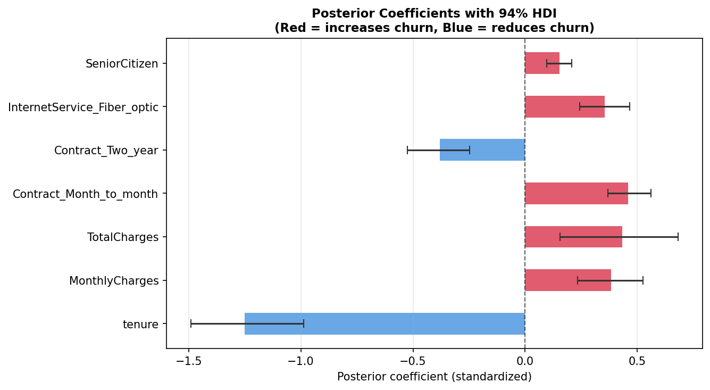
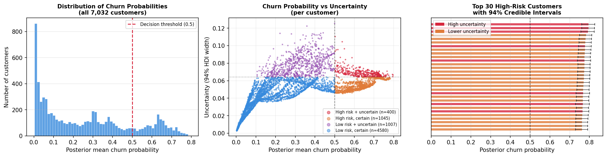
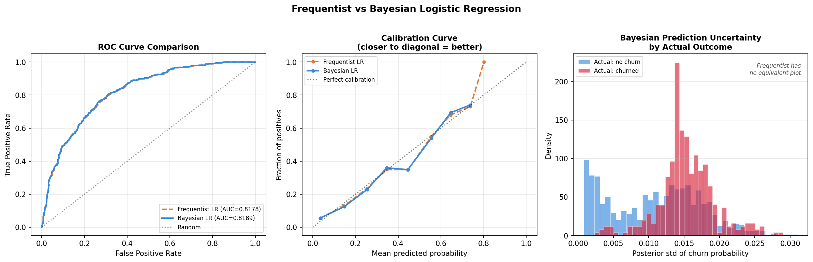
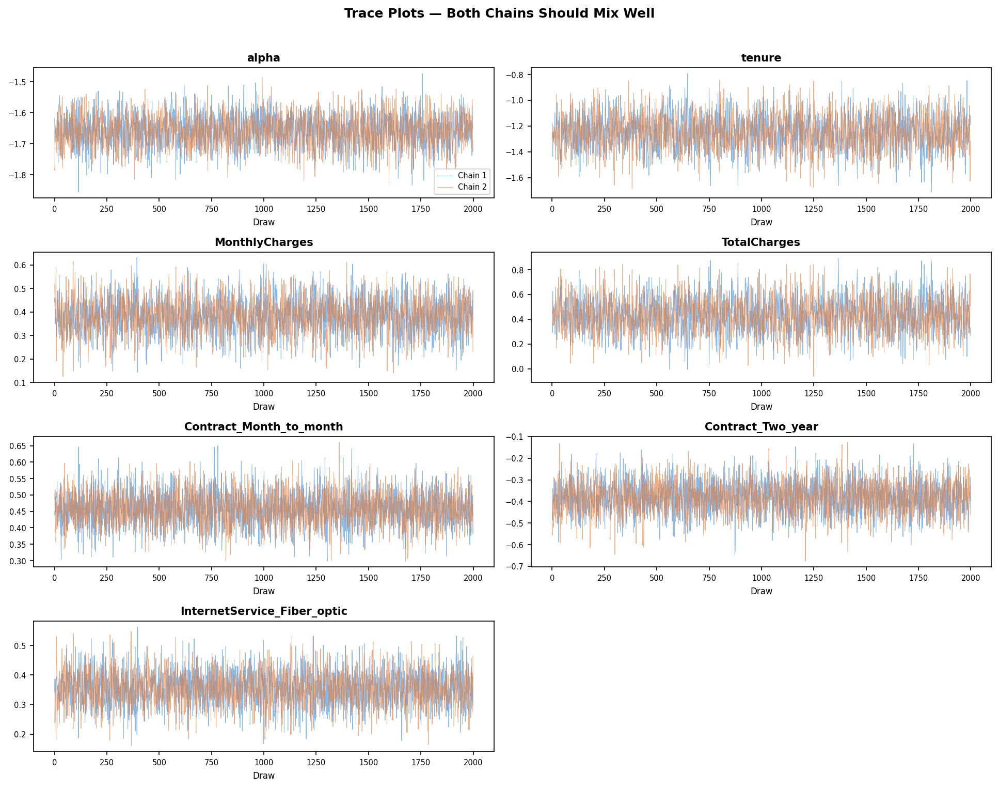

# Bayesian Customer Churn Model

**Adding uncertainty quantification to churn prediction using PyMC and MCMC sampling.**

Most churn models give you a score. This one gives you a score *and* tells you how much to trust it — a distinction that matters when deciding how to allocate retention spend.

---

## The core idea

A standard logistic regression outputs a single probability per customer. A Bayesian logistic regression outputs a *distribution* over that probability — a full posterior that captures what the model knows and, crucially, what it doesn't.

This means you can segment customers not just by predicted risk, but by confidence:

| Segment | Action |
|---|---|
| High risk, high confidence | Automated retention offer |
| High risk, uncertain | Human review before acting |
| Low risk | No action needed |

**Result: 400 customers flagged as both high-risk (>50% churn probability) and high-uncertainty — prioritised for human review before any retention spend.**

---

## Dataset

IBM Telco Customer Churn — 7,032 customers, 20 features, 26.6% churn rate.  
Source: [Kaggle](https://www.kaggle.com/datasets/blastchar/telco-customer-churn)

---

## Results

### Posterior coefficients (94% HDI)

All HDI intervals exclude zero — every feature has a credible directional effect on churn.

| Feature | Posterior mean | Direction |
|---|---|---|
| tenure | -1.25 | Longer tenure → lower churn ✅ |
| Contract: month-to-month | +0.46 | No lock-in → higher churn ✅ |
| TotalCharges | +0.43 | Higher spend → higher churn |
| MonthlyCharges | +0.38 | Higher bill → more likely to leave |
| Contract: two-year | -0.38 | Locked in → lower churn ✅ |
| Fiber optic internet | +0.36 | Competitive market → higher churn |
| SeniorCitizen | +0.15 | Small but credible effect |

### Model comparison

| Metric | Frequentist LR | Bayesian LR |
|---|---|---|
| AUC | 0.8178 | 0.8189 |
| Brier score | 0.1462 | 0.1458 |
| Per-prediction uncertainty | ✗ | ✓ |
| Calibrated credible intervals | ✗ | ✓ |

AUC is essentially identical — the Bayesian advantage is not accuracy, it's knowing *when not to trust the prediction*.

### Convergence diagnostics

| Check | Result | Threshold |
|---|---|---|
| R-hat (all params) | 1.000 | < 1.01 |
| ESS bulk (min) | 1,960 | > 400 |
| ESS tail (min) | 2,193 | > 400 |
| Divergences | 0 | 0 |

---

## Repo structure

```
bayesian_churn/
├── data/
│   └── WA_Fn-UseC_-Telco-Customer-Churn.csv
├── notebooks/
│   ├── 01_eda.ipynb                # Churn rates by segment, feature correlations
│   ├── 02_bayesian_model.ipynb     # Prior elicitation, PyMC model, MCMC sampling (GPU)
│   ├── 03_inference.ipynb          # Convergence diagnostics, posterior plots, uncertainty
│   └── 04_comparison.ipynb         # Bayesian vs frequentist on AUC, Brier, calibration
├── outputs/
│   ├── trace.nc                    # ArviZ InferenceData (saved posterior)
│   └── customer_uncertainty.csv    # Per-customer risk + uncertainty scores
└── assets/
    ├── posterior_forest.png        # Coefficient plot with 94% HDI
    ├── trace_plots.png             # Chain mixing diagnostics
    ├── posterior_analysis.png      # Risk × uncertainty segmentation
    └── comparison.png              # Frequentist vs Bayesian comparison
```

---

## Visualisations

### Posterior coefficients


### Risk × uncertainty segmentation


### Frequentist vs Bayesian


### Convergence (trace plots)


---

## Setup

### 1. Clone and create virtual environment

```bash
git clone <your-repo-url>
cd bayesian_churn
python3 -m venv .venv
source .venv/bin/activate        # Windows: .venv\Scripts\activate
```

### 2. Install dependencies

```bash
pip install pymc arviz scikit-learn pandas matplotlib pytensor numpyro blackjax
```

**GPU acceleration (NVIDIA only):** GPU sampling is supported via NumpyPro + JAX and runs ~5–10x faster than CPU. Install the CUDA-enabled JAX build after the above:

```bash
pip install "jax[cuda12]==0.4.38" "jaxlib==0.4.38"
```

Check your CUDA version first with `nvidia-smi` — use `cuda12` for CUDA 12.x and above.

### 3. Run notebooks in order

```bash
jupyter notebook
```

Open and run notebooks in order: `01_eda` → `02_bayesian_model` → `03_inference` → `04_comparison`.

> **Note:** `02_bayesian_model.ipynb` must be run before `03_inference.ipynb` and `04_comparison.ipynb` — it generates `outputs/trace.nc` which the later notebooks depend on.

### Sampling time

| Hardware | Backend | Time (2000 draws, 4 chains) |
|---|---|---|
| NVIDIA GPU (CUDA) | NumpyPro/JAX | ~40 sec |
| CPU | NumpyPro/JAX | ~4 min |

### Tested with

```
Python      3.12.3
PyMC        5.28.4
ArviZ       0.21.0
JAX         0.4.38
JAXlib      0.4.38
NumpyPro    0.16.1
scikit-learn 1.5.0
```

---

## Why Bayesian?

Three scenarios where this approach has a concrete advantage over sklearn:

1. **Small data** — priors regularise naturally without cross-validated hyperparameters
2. **Prior knowledge** — domain expertise (e.g., "month-to-month contracts churn more") encodes directly into the model as priors, not just as feature engineering
3. **Decision-making under uncertainty** — when a churn intervention costs money, knowing the model is uncertain about a customer is itself actionable information

---

## Potential extensions

- **Hierarchical model**: partial pooling across customer segments (region, product tier) — priors on priors
- **Belief-state MDP**: Bayesian churn uncertainty maps naturally to a POMDP where the optimal retention policy depends on resolving belief uncertainty first — a natural RL extension
- **Online updating**: as new data arrives, the posterior becomes the next prior — no retraining from scratch
